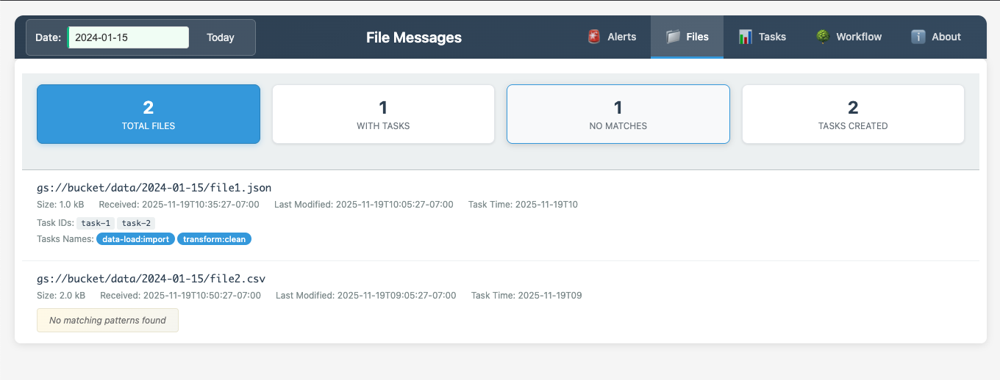
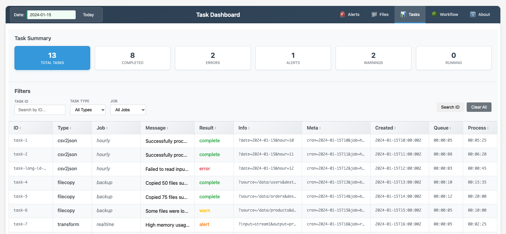
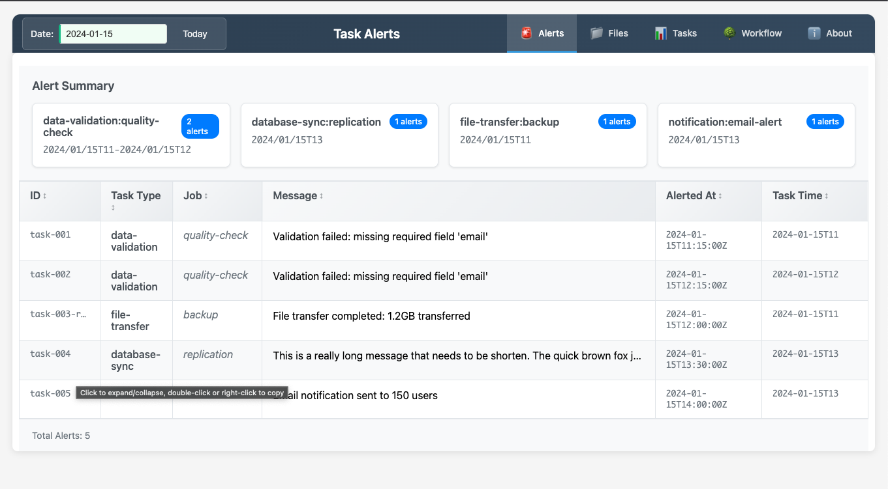
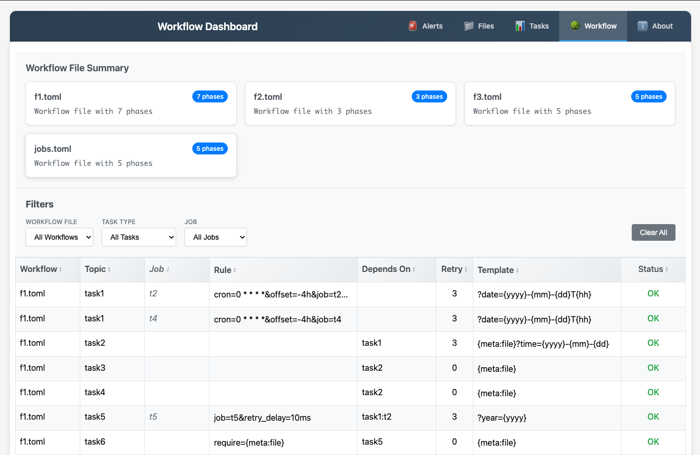

# flowlord taskmaster


**Flowlord** is a production-ready task orchestration engine that manages complex workflow dependencies with intelligent scheduling, automatic retries, and real-time monitoring. Built on the [task](https://github.com/pcelvng/task) ecosystem, it coordinates distributed workers through message bus communication while providing visibility into task execution through a web dashboard.

**Key Features:**
- **Workflow Management** - Define multi-phase workflows with parent-child task dependencies
- **Intelligent Scheduling** - Cron-based scheduling with template-based task generation
- **Automatic Retries** - Configurable retry logic with exponential backoff and jitter to prevent thundering herd
- **File Watching** - Trigger tasks automatically when files are written to specified paths
- **Batch Processing** - Generate multiple tasks from date ranges, metadata arrays, or data files
- **Alerting** - Slack notifications for failed tasks and incomplete jobs with smart frequency management
- **RESTful API** - Web UI and API for monitoring workflows, viewing task history, and managing alerts

[](https://github.com/pcelvng/task-tools/wiki/Flowlord-API)

<br clear="all"/>

## Overview 


## Monitoring & Troubleshooting

SQLite is used to store phases and provides troubleshooting convenience by recording task history. As flowlord is stateless task management system, the cache persistent is not required for flowlord to work, but it convenient to review historical tasks and alerts. It is recommended to backup the task and alert logs for long term storage. 

- **Task Records** - Full execution lifecycle with timing metrics
- **Alert History** - Failed task tracking for debugging
- **File Processing Audit** - Which files triggered which tasks
- **Workflow State** - Phase configuration and dependencies

The database is optional and non-critical. If deleted, Flowlord continues normally and rebuilds fresh data. Features:
- Automatic backup/restore from remote paths (S3/GCS)
- 90-day default retention with automatic cleanup
- WAL mode for concurrent access

**Configuration:**
```toml
[cache]
  local_path = "./tasks.db"              # required local cache
  backup_path = "gs://bucket/tasks.db"   # Optional backup location
  retention = "2160h"                    # 90 days
  task_ttl = "4h"                        # Alert deadline from task to complete (creation to complete)  
```

## Web Dashboard

Built-in web UI for monitoring workflows and troubleshooting. Uses Go templates to render HTML dashboards with:
- Task execution history with filtering and pagination
- Alert summaries grouped by task type
- File processing history
- Workflow phase visualization
- System statistics

Access at `http://localhost:8080/` (or configured port)

| Files View | Tasks View | Alerts View | Workflow View |
|:----------:|:----------:|:-----------:|:-------------:|
| [](../../internal/docs/img/flowlord_files.png) | [](../../internal/docs/img/flowlord_tasks.png) | [](../../internal/docs/img/flowlord_alerts.png) | [](../../internal/docs/img/flowlord_workflow.png) |


## workflow 
A workflow consists of one or more phases as a way to define of how a set of task is to be scheduled and run and the dependencies between them. 

``` toml 
[[Phase]]
task = "topic_name"
dependsOn = ""
rule = "cron=0 * * * *&offset=-4h&job=t2"
retry = 3
template = "?date={yyyy}-{mm}-{dd}"

[[Phase]]
task = "task1"
dependsOn = "topic_name"
rule = "retry_delay=30s"
retry = 3
template = "?hour={yyyy}-{mm}-{dd}T{hh}"
```

### Phase 

 - **task**: the name of the topic this task will be sent to. It is also the unique name of the task. In Addition a job of a task can be added in the task name using a colon (:) as a separator (task:job)
 - **dependsOn**: 
   - the name of the parent task
   - this task will start after the parent task has completed successfully
   - if left blank this tasks will only start based on the rule
 - **rule**: rules on about the tasks that are encoded as query params 
   - _cron_: schedule the task based on the cron pattern (see scheduling)
   - _offset_: offsets the current time passed into the template
   - _files_: used in conjection with a filewatcher to start tasks after a file is written
   - _require_: used in a child task saying to only start task if value is present
   - _retry_delay_: duration to wait before retrying the task
   - _no_alert_: disable alerting on failed tasks
   - batching to create multiple jobs
     - _for_: create a number of jobs starting with current time + offset to end of for statement 
     - _by_: iterator when creating tasks. day (default), hour, month
     - _meta_: create a task for each item in the array passed in as meta. 
     - _meta-file_: path to a file (json,csv) use to meta data template, each row will create a task.  
 - **retry**: the number of times a task is retried before being sent to failed_tasks
 - **template**: a URL string that is parsed and put into the task's info string when created

### Template 
templating is used to create dynamic tasks based on the time run or previous jobs run. templates are designated with surrounding brackets `{}`

| keyword      | definition                                       |
|--------------|--------------------------------------------------|
| {yyyy}       | year                                             |
| {dd}         | day of month (1-31)                              | 
| {mm}         | month of year (1-12)                             | 
| {hh}         | hour of day (0-23)                               | 
| {ts}         | full timestamp 20060102T150405                   | 
| {meta:(\w+)} | insert meta data provided in parent task or rule | 

The timestamp is derived from the parent task's info string and supports the following params and formats 

| field | format                    | example                    | 
|-------|---------------------------|----------------------------|
| day   | 2006-01-02                | ?day=2020-02-05            | 
| date  | 2006-01-02                | ?date=2010-10-12           | 
| hour  | 2006-01-02T15             | ?hour=2000-01-02T13        | 
| time  | 2006-01-02T15:04:05Z07:00 | ?time=2000-01-02T13:12:15Z | 

## rule
defition on how the phase's task/job is to be created 

### cron 
schedule a task based on a cron expression. 
`* * * * * * (second minute hour mday month wday)` 
The current time is used in the template to generate time specific tasks. An offset can be added to change the time used in the template. 

Example: schedule a task to run every day at 1 AM UTC. If this ran on 2020-01-02 the info string generated would be "?date=2020-01-01T19"
```
[[Phase]]
task = "topic"
rule = "cron=0 0 1 * * *&Offset=-6h"
template = "?date={yyyy}-{mm}-{dd}T{hh}"
```

### files 
schedule a task after a specified file is written. This should be used with the filewatcher taskmaster or GCP file watching service. File matching is done using the stdlib filepath.Match which does not support `**` matching. Flowlord will attempt to pull the timestamp from the filepath which will be used to populate the date-time in phase's template `{yyyy}|{dd}|{mm}|{hh}`. The matching file can be referenced in the phase's template with `{meta:file}.`. The filename can be references with `{meta:filename}`.

``` toml 
[[Phase]]
task = "topic"
rule = "files=/folder/*/*/*.txt"
template = "{meta:file}?opt=true"
```

### require

used to indicate a required field or value before starting a child process. 

``` toml 
[[Phase]]
task = "child:job"
rule = "require:{meta:file}"
template = "{meta:file}" 
dependsOn = "parent:job"
```
The example task 'child:job' will only start if the parent job has file data in it's meta field. 

### batch 
batching is a way to create multiple tasks when the phase is run. This can be done with a date range or through different meta data. 

  * for: a duration for the job to be run from. Ex: -60h 
  * by: time iterator Ex: hour, day, month 
  * meta: comma separated data associate with a key. Each item will generate a new task Ex: meta=key:a,b,c|key2=1,2,3 
  * meta-file: a line deliminated data file. each row (line) will generate a new task. 

``` toml 
# run every day at 2:01:00 for multiple items
# generates 3 tasks with the info of 
# ?name=a&value=1 AND ?name=b&value=2 AND ?name=c&value=3
[[Phase]]
task="worker:job-meta"
rule="cron=0 1 2 * * *&meta=name:a,b,c|value:1,2,3" 
template="?name={meta:name}&value={meta:value}&day={yyyy}-{mm}-{dd}"

# run every day at 5:05:00
# generates a task for every line in the file
[[Phase]]
task="worker:job-file"
rule="cron=0 5 5 * * *&meta-file=data.json" 
template="?name={meta:name}&value={meta:value}&day={yyyy}-{mm}-{dd}"

# run every day for the last week 
# generates 8 tasks from today to 7 days ago
[[Phase]] 
task="worker:lastweek"
rule="cron=0 7 7 * * *&for=-168h&by=day
template=?day={yyyy}-{mm}-{dd}
```

