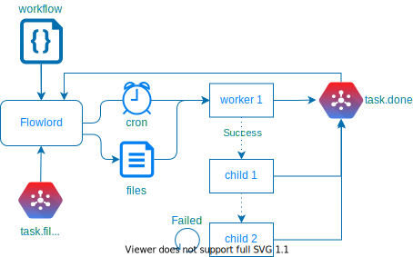

# flowlord taskmaster
flowlord schedules and coordinates task dependency across workflows. Flowlord reads tasks from the done topic, failed tasks can be configured to retry a set number of times before being sent to slack and/or a retry_failed topic. Successful tasks will start children tasks.



## workflow 
A workflow consists of one or more phases as a way to define of how a set of task is to be scheduled and run and the dependencies between them. 

``` toml 
[[Phase]]
task = "topic_name"
dependsOn = ""
rule = "cron=0 * * * *&offset=-4h&job=t2"
retry = 3
template = "?date={yyyy}-{mm}-{dd}"

[[Phase]]
task = "task1"
dependsOn = "topic_name"
rule = "retry_delay=30s"
retry = 3
template = "?hour={yyyy}-{mm}-{dd}T{hh}"
```

### Phase 

 - **task**: the name of the topic this task will be sent to. It is also the unique name of the task. In Addition a job of a task can be added in the task name using a colon (:) as a separator (task:job)
 - **dependsOn**: 
   - the name of the parent task
   - this task will start after the parent task has completed successfully
   - if left blank this tasks will only start based on the rule
 - **rule**: rules on about the tasks that are encoded as query params 
   - _cron_: schedule the task based on the cron pattern (see scheduling)
   - _offset_: offsets the current time passed into the template
   - _files_: used in conjection with a filewatcher to start tasks after a file is written
   - _require_: used in a child task saying to only start task if value is present
   - _retry_delay_: duration to wait before retrying the task
   - batching to create multiple jobs
     - _for_: create a number of jobs starting with current time + offset to end of for statement 
     - _by_: iterator when creating tasks. day (default), hour, month
     - _meta_: create a task for each item in the array passed in as meta. 
     - _meta_file_: path to a file (json,csv) use to meta data template, each row will create a task.  
 - **retry**: the number of times a task is retried before being sent to failed_tasks
 - **template**: a URL string that is parsed and put into the task's info string when created

### Template 
templating is used to create dynamic tasks based on the time run or previous jobs run. templates are designated with surrounding brackets `{}`

| keyword      | definition                                       |
|--------------|--------------------------------------------------|
| {yyyy}       | year                                             |
| {dd}         | day of month (1-31)                              | 
| {mm}         | month of year (1-12)                             | 
| {hh}         | hour of day (0-23)                               | 
| {ts}         | full timestamp 20060102T150405                   | 
| {meta:(\w+)} | insert meta data provided in parent task or rule | 

The timestamp is derived from the parent task's info string and supports the following params and formats 

| field | format                    | example                    | 
|-------|---------------------------|----------------------------|
| day   | 2006-01-02                | ?day=2020-02-05            | 
| date  | 2006-01-02                | ?date=2010-10-12           | 
| hour  | 2006-01-02T15             | ?hour=2000-01-02T13        | 
| time  | 2006-01-02T15:04:05Z07:00 | ?time=2000-01-02T13:12:15Z | 

## scheduling 

### cron 
schedule a task based on a cron expression. 
`* * * * * * (second minute hour mday month wday)` 
The current time is used in the template to generate time specific tasks. An offset can be added to change the time used in the template. 

Example: schedule a task to run every day at 1 AM UTC. If this ran on 2020-01-02 the info string generated would be "?date=2020-01-01T19"
```
[[Phase]]
task = "topic"
rule = "cron=0 0 1 * * *&Offset=-6h"
template = "?date={yyyy}-{mm}-{dd}T{hh}"
```

### files 
schedule a task after a specified file is written. This should be used with the filewatcher taskmaster or GCP file watching service. File matching is done using the stdlib filepath.Match which does not support `**` matching. Flowlord will attempt to pull the timestamp from the filepath which will be used to populate the date-time in phase's template `{yyyy}|{dd}|{mm}|{hh}`. The matching file can be referenced in the phase's template with `{meta:file}.`. The filename can be references with `{meta:filename}`.

```
[[Phase]]
task = "topic"
rule = "files=/folder/*/*/*.txt"
template = "{meta:file}?opt=true"
```

### require

used to indicate a required field or value before starting a child process. 

```
[[Phase]]
task = "child:job"
rule = "require:{meta:file}"
template = "{meta:file}" 
dependsOn = "parent:job"
```
The example task 'child:job' will only start if the parent job has file data in it's meta field. 
