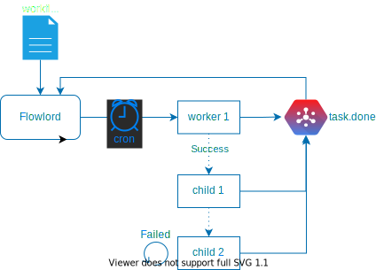

# flowlord taskmaster
flowlord schedules and coordinates task dependency across workflows. Flowlord reads tasks from the done topic, failed tasks can be configured to retry a set number of times before being sent to slack and/or a retry_failed topic. Successful tasks will start children tasks.



## workflow 
A workflow consists of one or more phases as a way to define of how a set of task is to be scheduled and run and the dependencies between them. 

``` toml 
[[Phase]]
task = "topic_name"
dependsOn = ""
rule = "cron=0 * * * *&offset=-4h&job=t2"
retry = 3
template = "?date={yyyy}-{mm}-{dd}T{hh}"

[[Phase]]
task = "task1"
dependsOn = "topic_name"
rule = ""
retry = 3
template = "?date={yyyy}-{mm}-{dd}T{hh}"
```

### Phase 

 - task: the name of the topic this task will be sent to. It is also the unique name of the task
 - dependsOn: 
   - the name of the parent task
   - this task will start after the parent task has completed successfully
   - if left blank this tasks will only start based on the rule
 - rule: rules on about the tasks that are encoded as query params 
   - cron: schudule the task based on the cron pattern (see scheduling)
   - job: additional name for tasks that share the same topic 
 - retry: the number of times a task is retried before being sent to failed_tasks
 - template: a URL string that is parsed and put into the task's info string when created

### Template 
templating is used to create dynamic tasks based on the time run or previous jobs run. templates are designated with surrounding brackets `{}`

| keyword | definition |
|-|-|
| {yyyy} | year |
| {dd} | day of month (1-31) | 
| {mm} | month of year (1-12) | 
| {hh} | hour of day (0-23) | 
| {ts} | full timestamp 20060102T150405 | 
| {meta:(\w+)} | use meta data provide in a parent task| 

## scheduling 

### cron 
schedule a task based on a cron expression. 
`* * * * * * (second minute hour mday month wday)` 
The current time is used in the template to generate time specific tasks. An offset can be added to change the time used in the template. 

Example: schedule a task to run every day at 1 AM UTC. If this ran on 2020-01-02 the info string generated would be "?date=2020-01-01T19"
```
[[Phase]]
task = "topic"
rule = "cron=0 0 1 * * *&Offset=-6"
template = "?date={yyyy}-{mm}-{dd}T{hh}"
```

