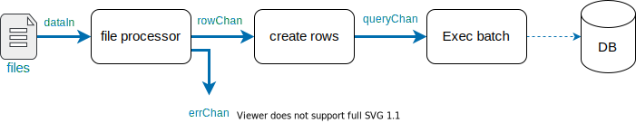

# sql-load
A generic worker to load a newline delimited json (ndj) into a sql database

Initially only postgresql will be supported
## info query params:
* `origin` : (required) file, or folder path (all files) to parse and insert into `table`
* `table` : (required), the name of the table to be inserted into i.e., schema.table_name
* `delete` : will build and run a delete statement based on provided params
  * this is executed before the insert statements
  * provide a list of delete key:values to be used in the delete statement
  * `"?delete=date:2020-07-01|id:7"`
* `truncate`: will truncate (delete all) from the `table` before the insert
* `fields` : allows mapping different json key values to different database column names
  * provide a list of field name mapping {json key name}:{DB column name} to be mapped 
  * `?fields=jsonKeyName:dbColumnName`
* `cached_insert` : will create a temp table for insert
  * this temp table data will then be inserted into the [`table_name`]
  * greatly improves performance. 
  * supports array data types
* `batch_size` : number of rows to insert at once (default: 1000)

Example tasks:

```json 
// These will use the sql batch loader
{"type":"sql_load","info":"gs://bucket/path/to/file.json?table=schema.table_name&delete=date:2020-07-01|id:7"}

{"type":"sql_load","info":"gs://bucket/path/of/files/to/load/?table=schema.table_name"}

{"type":"sql_load","info":"gs://bucket/path/to/file.json?table=schema.table_name&delete=date:2020-07-01|id:7&fields=jsonKeyValue:dbColumnName"}

// These examples will use the cached_insert 
// this creates a temp table to insert the data, 
// and inserts into the main table from the temp table to improve insert loading time
{"type":"sql_load","info":"gs://bucket/path/to/file.json?cached_insert&table=schema.table_name&delete=date:2020-07-01|id:7&fields=jsonKeyValue:dbColumnName"}

{"type":"sql_load","info":"gs://bucket/path/to/file.json?cached_insert&table=schema.table_name&truncate&fields=jsonKeyValue:dbColumnName"}
```

## Technical: 

### JSON and ARRAY postgres types
When loading json or jsonb column types you can load the following:
- `["1","2","3"]`
- `{"column_name":{"field":"value"}}`

When loading ARRAY postgres types, if the value is a json object array it can be loaded normally.
- `[1,"two","three"]`

When loading a quoted string for an ARRAY type it must be enclosed in `{}` curly braces
- `"{1,2,3}"`

### Below are examples of data loading for CSV and JSON files

#### CSV files and loading JSON and ARRAY postgres types
When loading a csv file that has json or array types,
you must escape quotes by double quoting them. See below:

Here is an example of a properly formatted csv file with json and array types.
```csv
id,name,json_field,jsonb_field,array_string_type,array_int_type
2,"2a name","{""test"":[""1"",""2"",""3""]}"
3,3a name,"{""key2"":""value2""}","{""test"":[""1"",""2"",""3""]}","{""a"",""b"",""c""}","{1,2,3}"
```

#### JSON loading with JSON and ARRAY postgres types
When loading JSON values as part of a JSON row, values can be loaded either as quoted strings, or as actual json objects.
For example here are two rows to load that have the same data formatted as a escaped string or as an actual json object.
```json
{"id":12, "name": "12a name", "json_field": {"one":1,"string":"string","array":["a","b","c"]}, "array_string_type":[1,"two","three"], "array_int_type":"{6,7,8}"}
{"id":13, "name": "13a name", "jsonb_field": {"one":1,"string":"string","array":["a","b","c"]}, "array_string_type":"{1,\"two\",\"three\"}", "array_int_type":[6,7,8]}
```


### data flow through channels 
